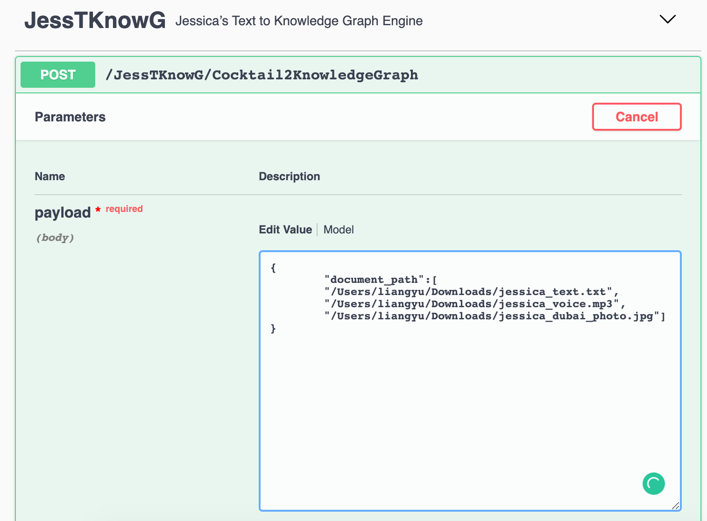
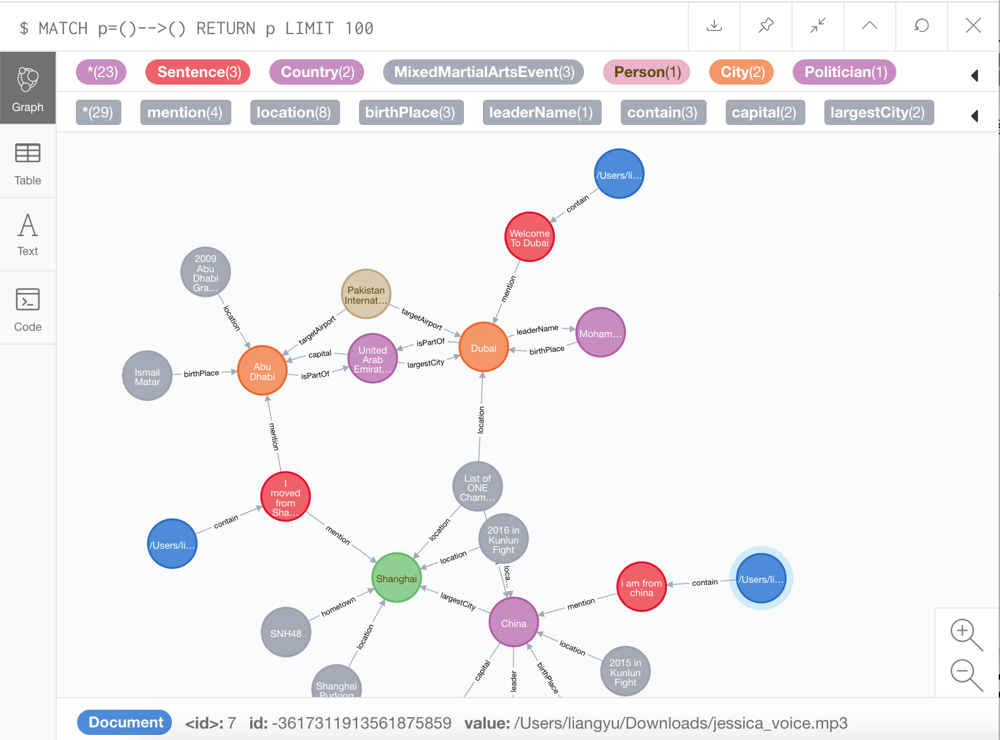
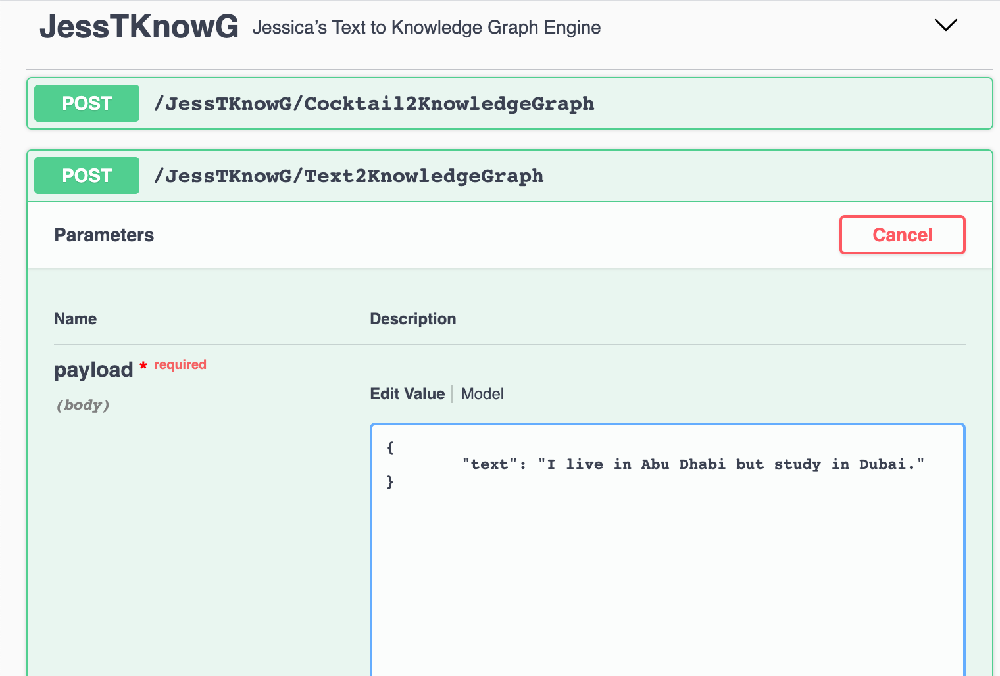
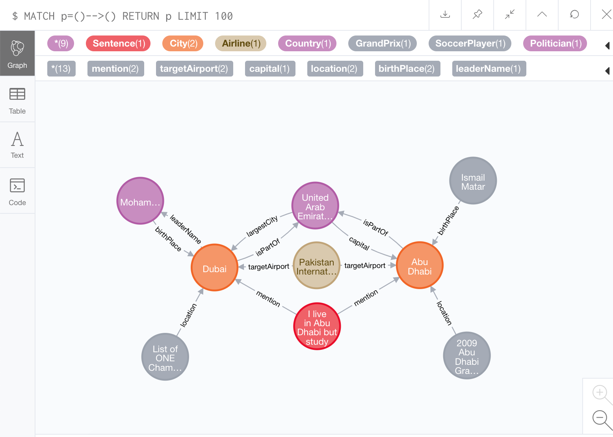
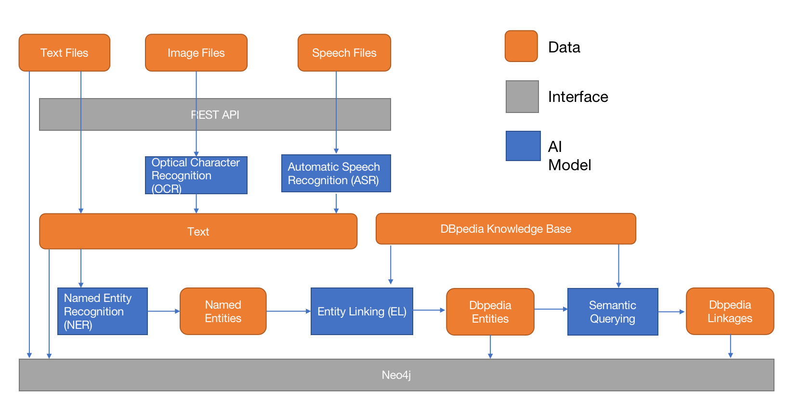
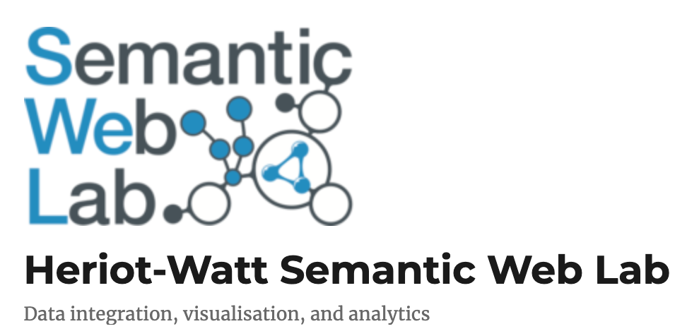

# Jessica's Engine of Text to Knowledge Graph

## starting the service

```bash
docker run -it \
-v /Users/liangyu/Downloads/:/Users/liangyu/Downloads/ \
-p 7474:7474 \
-p 7687:7687 \
-p 9000:9000 \
-p 8080:8080 \
jessica_text_to_knowledge_graph:1.0.1
```

## the interface

input your data at rest api: http://0.0.0.0:9000/

view your output at neo4j: http://0.0.0.0:7474/ with a Cypher code

```
MATCH p=()-->() RETURN p LIMIT 100
```

## input examples
```
{
	"text": "I live in Abu Dhabi but study in Dubai."
}

{
	"text": "I want to work for Apple. Steve Jobs is my idol. "
}

{
	"document_path":[
	"/jessica_text.txt",
	"/jessica_voice.mp3",
	"/jessica_dubai_photo.jpg"]
}

{
	"document_path":[
	"/Users/liangyu/Downloads/jessica_text.txt",
	"/Users/liangyu/Downloads/jessica_voice.mp3",
	"/Users/liangyu/Downloads/jessica_dubai_photo.jpg"]
}
```

## outputs 
<table>
  <thead>
    <tr>
      <th>Input</th>
      <th>Output</th>
    </tr>
  </thead>
  <tr>
    <td>      
      
    </td>
    <td>

    </td>
  </tr>
  <tr>
    <td>  

    </td>
    <td>

    </td>
  </tr>
</table>

## what is inside the engine



## contact me

by email gaoyuanliang@outlook.com if you want to know more about my engin, or schedule a live demo by me.

I am open for internshipe/partime job of data science/AI. Next year I will graduate from Heriot-Watt University Dubai, open for full-time job. 

## Thanks given to 

Heriot-Watt Semantic Web Lab, http://www.macs.hw.ac.uk/SWeL/, the leading reasearchers of knowledge management and semantic network

 


