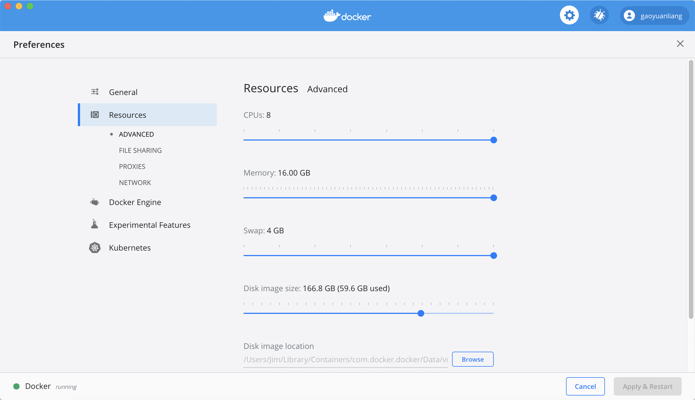
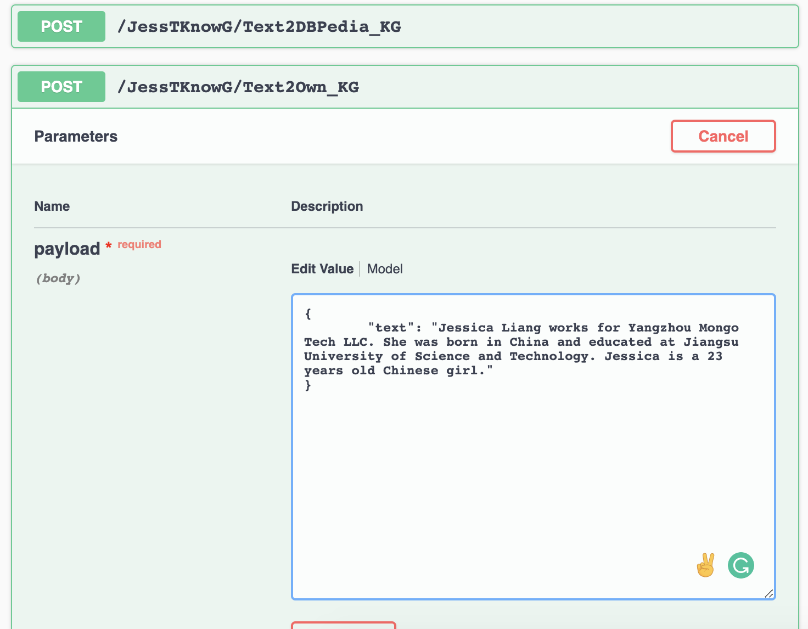
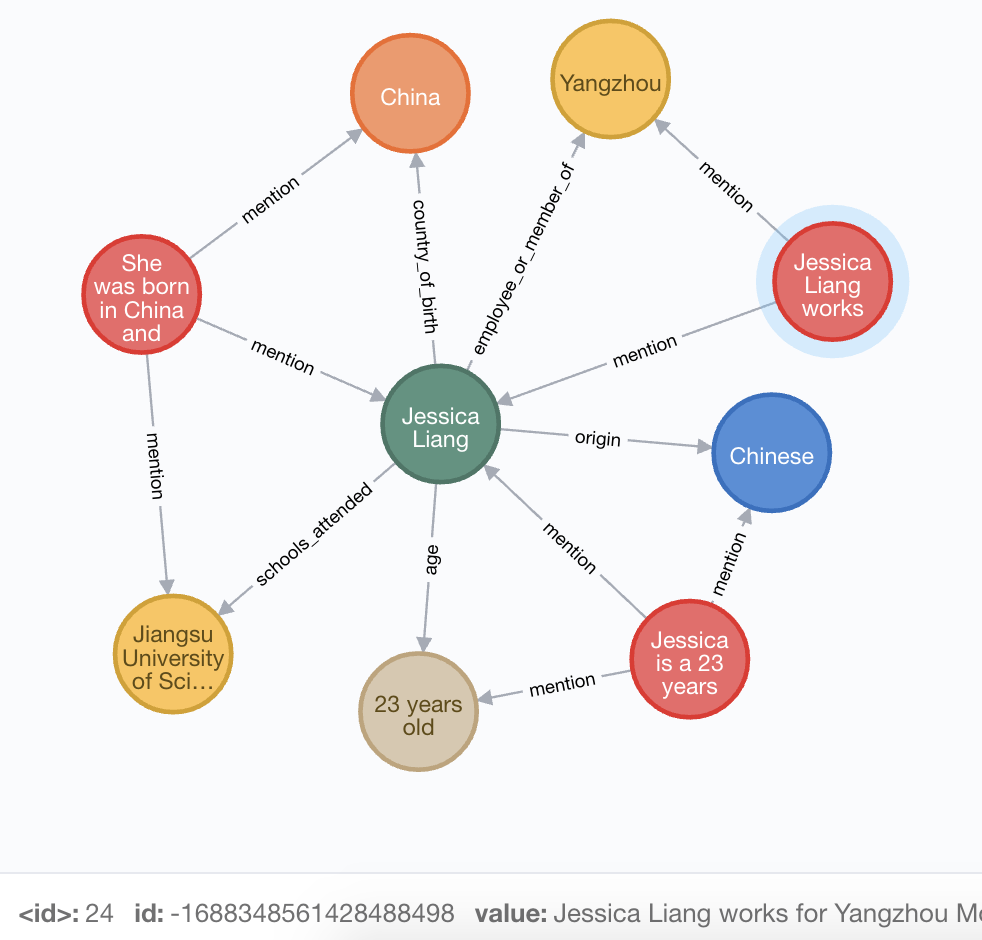
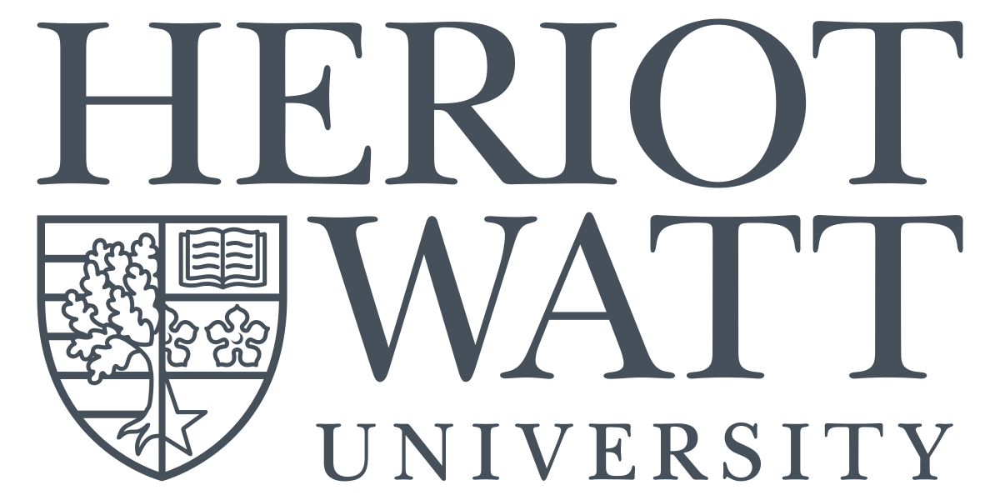
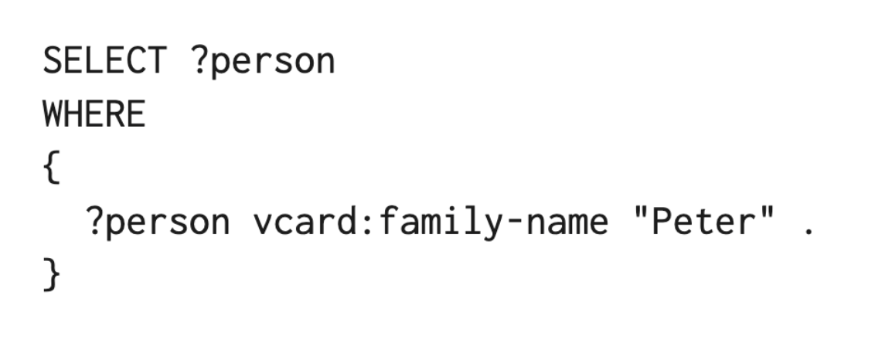

# Jessica's Text to Knowledge Graph Engine

Extracting texts from MP3 audio, JPG images, and text documents. Converting text to Knowledge Graph. Linking the text to the DBpedia entities' URL. Not only the directly mentioned entities but also the entities hidden in the DBpedia, but closely related to the content of the text. If the text is about yourself and it cannot find anything linked to DBpedia, it can also generate your won knowledge graph, by detecting entities and grouping different forms of the same entities, and also extracting the relations among the entities.


## starting the service on your laptop

The program is in a docker. The docker itself is 10.87 GB large. Make sure your laptop has storage and memory big enough. For myself, my Laptop has 16G memory and 500G storage. The docker runs well on my laptop. Give enough resource to your docker.



You can directly pull the docker from the docker hub using the following command, 

```bash
docker pull gaoyuanliang/jessica_text_to_knowledge_graph:1.0.3
```

Then start the service using the following command. This process loads many models and knowledge graph data, so it may take a while. For my Mac, it takes around half-hour. 

```bash
docker run -it \
-m 16g \
-p 7474:7474 \
-p 7687:7687 \
-p 9000:9000 \
-p 8080:8080 \
-v /Users/liangyu/Downloads/:/Downloads/ \
gaoyuanliang/jessica_text_to_knowledge_graph:1.0.3
```

## the interface

input your data at rest API: http://0.0.0.0:9000/

view your output at neo4j: http://0.0.0.0:7474/ with a Cypher code

```
MATCH p=()-->() RETURN p LIMIT 100
```

## input examples in JSON format

### Text2Own_KG

Convert your won story to your won knowledge graph, even you are not famous enough to be linked to DBpedia/Wikipedia.

```python
{
	"text": "Jessica Liang works for Yangzhou Mongo Tech LLC. She was born in China and educated at Jiangsu University of Science and Technology. Jessica is a 23 years old Chinese girl."
}

{
	"text": "Mongo Tech LLC is located at Yangzhou of China, and it is found by Sen Zhou."
}
```

### Text2DBPedia_KG
convert a text to a DBpedia knowledge graph
```python
{
	"text": "I live in Abu Dhabi but study in Dubai."
}

{
	"text": "I want to work for Apple. Steve Jobs is my idol. I want to work in California. "
}

{
	"text": "I am from Shandong of China, and study at the Heriot-Watt University. I love shopping at Taobao of Alibaba."
}
```

### Cocktail2DBPedia_KG
convert a group of documents to a DBpedia knowledge graph. The input is a list of document paths
```python
{
	"document_path":[
	"/jessica_text.txt",
	"/jessica_voice.mp3",
	"/jessica_etisalat.jpeg",	
	"/jessica_dubai_photo.jpg"]
}

{
	"document_path":[
	"/Downloads/jessica_text.txt",
	"/Downloads/jessica_voice.mp3",
	"/Downloads/jessica_etisalat.jpeg",	
	"/Downloads/jessica_dubai_photo.jpg"]
}
```

## outputs 
<table>
  <thead>
    <tr>
      <th>Input</th>
      <th>Output</th>
    </tr>
  </thead>
  <tr>
    <td>      
      
    </td>
    <td>

    </td>
  </tr>
  <tr>
    <td>  

    </td>
    <td>

    </td>
  </tr>
  <tr>
    <td>  

    </td>
    <td>

    </td>
  </tr>
</table>

## what is inside the engine


## contact me

by email gaoyuanliang@outlook.com if you want to know more about my engine, or schedule a live demo by me.

I am open to an internship/part-time job in data science/AI. Next year I will graduate from Heriot-Watt University Dubai, open for a full-time job. 

## Thanks given to 

This engine is heavily based on the RDF knowledge graph database and its SPARQL query language. Links to RDF and SPARQL from 
Heriot-Watt Semantic Web Lab: http://www.macs.hw.ac.uk/SWeL/2019/10/28/sparql-for-beginners/. The Heriot-Watt Semantic Web is a world-leading research lab of knowledge management and semantic network. 

 

### RDF


###  SPARQL 

